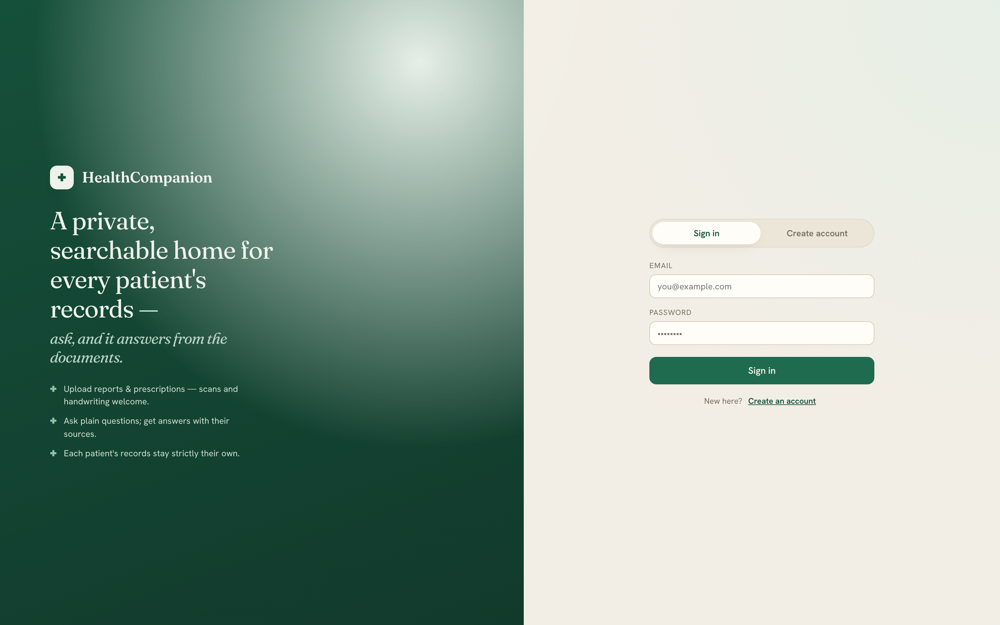
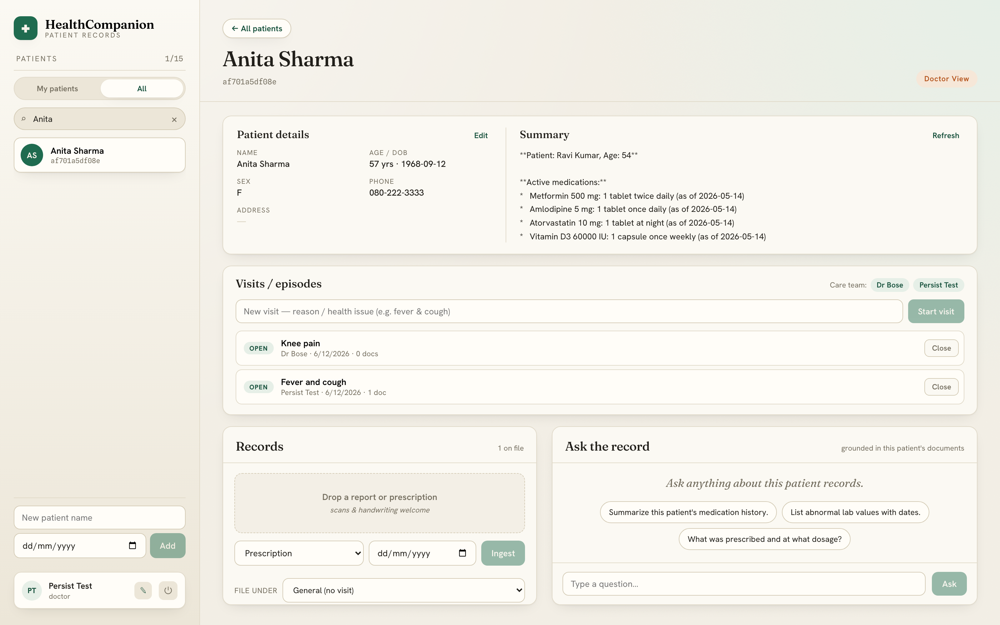
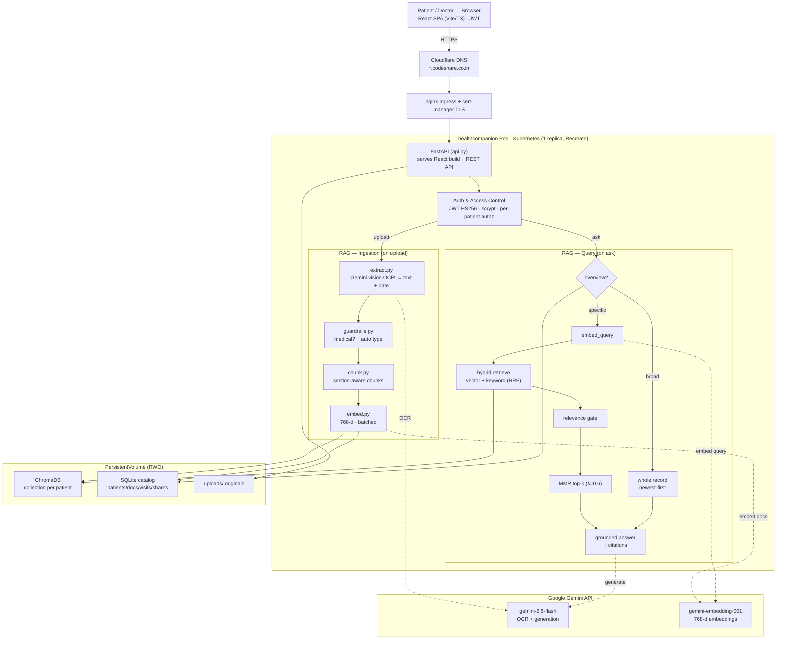

<div align="center">

# 🏥 HealthCompanion

### A per-patient medical RAG system — upload records, ask grounded questions, get cited answers.

[](https://healthcompanion.codeshare.co.in)


</div>

---

**HealthCompanion** gives every patient a private, searchable medical record. Patients
and doctors upload documents — prescriptions, lab reports, clinical notes, **including
scanned and handwritten ones** — and ask natural-language questions that are answered
**only from that patient's documents**, with source citations. It models how care
actually works: authentication with roles, **visits/episodes** (a patient treated by
different doctors for different problems over time), a doctor directory, **patient-controlled
document sharing**, in-portal **prescription drafting**, AI summaries, content guardrails,
and **deletion/retention rules** — running live on Kubernetes with full CI/CD.

> ⚠️ Built for **synthetic / de-identified data** as a portfolio project. Real patient
> PHI would require Vertex AI under a BAA, audit logging, and stricter controls.

## 🔗 Live demo

**https://healthcompanion.codeshare.co.in** — sign up as a **patient** (your own record)
or a **doctor** (only the patients in your care + documents they share with you).

| Login | Portal |
|---|---|
|  |  |

## ✨ Highlights

- **Reads scans & handwriting** — Gemini vision transcribes images/PDFs directly (no
  separate OCR engine), auto-detecting the document's **date** and **type**. Handwritten
  drug names are transcribed as-written and flagged when uncertain — never "auto-corrected"
  into a confident wrong name.
- **Hybrid retrieval** — semantic vector search **+** keyword search, fused with
  Reciprocal Rank Fusion, then **MMR** for diversity and a **relevance gate** — broad
  questions summarize the whole record, specific ones do precise top-k retrieval.
- **Grounded, cited answers** — every answer comes from the patient's own documents and
  cites the source; it **reports, doesn't interpret** (won't invent a diagnosis from an
  unlabelled value) and says *"I couldn't find that in your records"* instead of hallucinating.
- **Strict per-patient isolation** — each patient has a dedicated vector collection *and*
  a metadata filter on every query *and* API access control; a patient can never reach
  another's data (enforced server-side, tested).
- **Privacy by design** — doctors see only their own patients/visits **plus documents the
  patient explicitly shares**; chat is **never stored** and is invisible to the other party.
- **Visits / episodes of care** — documents and Q&A are organized into visits, each
  attributed to a doctor (or self), building a timeline across problems and doctors over time.
- **In-portal prescriptions** — a doctor can draft a structured prescription and add it
  straight to the patient's record (searchable like any document).
- **View the original** — open the actual uploaded scan/PDF to verify a handwritten name
  or read a graph the OCR can't reproduce.
- **Deletion & retention rules** — doctors can never delete a record; a patient can delete
  their own upload while it's private, but it **locks** a few hours after being shared;
  long-inactive doctor-created patients age out of doctors' views.
- **Role-aware** — the same records read as clinical notes for a doctor and plain-language
  guidance for a patient.
- **Content guardrail** — non-medical uploads (marksheets, selfies) are rejected before storage.
- **Cached AI summaries** — an at-a-glance clinical summary per patient and per visit,
  regenerated only when documents change.
- **Production-grade delivery** — single-container build, GitHub Actions CI/CD → GHCR,
  ArgoCD GitOps on Kubernetes, Let's Encrypt TLS, persistent storage, health/readiness probes.

## 🏗️ Architecture



<details>
<summary>Container view &amp; data-flow (text)</summary>

```
                         ┌─────────────────────── Single container ───────────────────────┐
   Browser ── HTTPS ──►  │  FastAPI  ──serves──►  React/Vite SPA (same origin, no CORS)    │
   (React UI)            │     │                                                            │
                         │     ├─ Auth: JWT + scrypt, role-based access control            │
                         │     ├─ SQLite  (patients, documents, users, visits, care team)  │
                         │     ├─ ChromaDB (per-patient vector collections)                │
                         │     └─ Google Gemini ── vision OCR · embeddings · generation    │
                         └────────────────────────── /data (persistent volume) ────────────┘

   INGEST:  file ─► Gemini vision OCR (text + date) ─► medical guardrail (+ auto type)
                 ─► section-aware chunk ─► embed ─► Chroma (per-patient, + visit tag) & SQLite
   ASK:     question ─► route (overview vs specific) ─► embed ─► hybrid retrieve
                 (vector + keyword RRF, scoped to patient/visit/shared) ─► relevance gate
                 ─► MMR top-k ─► grounded, cited Gemini answer
```

</details>

## 🛠️ Tech stack

| Layer | Choice | Why |
|---|---|---|
| AI | **Google Gemini** (`google-genai`) | One provider for vision OCR + embeddings + generation |
| Vector store | **ChromaDB** | Local, zero-ops, metadata filtering for isolation |
| Catalog / accounts | **SQLite** | Zero-ops relational store |
| Backend | **FastAPI** | Async, validation, dependency-injected auth |
| Frontend | **React + Vite + TypeScript** | Typed, fast, component-based portal |
| Auth | **JWT + scrypt** | Standard, no native deps |
| Packaging | **Docker** (multi-stage) | One image serves API + SPA |
| CI/CD | **GitHub Actions → GHCR** | Auto-versioned image on every push |
| Deploy | **Kubernetes + ArgoCD** | GitOps, self-healing, TLS, persistent volume |

## 🚀 Run locally

```bash
# Backend
pip install -r requirements.txt
cp .env.example .env            # add your Gemini key (aistudio.google.com/apikey)
uvicorn api:app --reload        # http://localhost:8000  (API + /docs)

# Frontend (separate terminal)
cd frontend && npm install && npm run dev   # http://localhost:5173
```

There's also a CLI for the core pipeline:

```bash
python cli.py add-patient --name "Jane Doe"
python cli.py ingest <id> ./prescription.jpg --type rx
python cli.py ask <id> "Which medicines do I take at night?" --role patient
```

## 🔌 API (selected)

All `/patients*` routes require `Authorization: Bearer <jwt>`.

```
POST /auth/signup · /auth/login        GET /auth/me · /doctors · PATCH /auth/profile
GET/POST /patients                     GET/PATCH /patients/{id} · GET /patients/{id}/care-team
POST /patients/{id}/documents          GET /patients/{id}/documents
PATCH/DELETE /documents/{id}           GET /documents/{id}/file        (view original scan/PDF)
GET/POST/DELETE /documents/{id}/share  GET /documents/{id}/shares      (patient-controlled sharing)
POST /patients/{id}/prescriptions      (doctor drafts a prescription)
POST /patients/{id}/ask                GET /patients/{id}/summary
GET/POST /patients/{id}/visits         POST /visits/{id}/close · GET /visits/{id}/summary
GET /healthz · /readyz                 (liveness / readiness probes)
```

Interactive OpenAPI docs are served at `/docs`.

## 🧪 Tests

```bash
pytest        # 67 tests; all Gemini calls mocked → offline, zero API quota
```

Covers the RAG pipeline, **patient isolation & privacy scoping**, auth & access control,
the medical guardrail, document sharing, in-portal prescriptions, the deletion/retention
rules, summary caching, and the visits/care-team model. A separate retrieval **eval
harness** (`scripts/eval_retrieval.py`) measures hit-rate against the real model.

## 📦 Project structure

```
api.py · cli.py · config.py · Dockerfile
src/healthcompanion/   gemini_client · extract · chunk · embed · vectorstore
                       guardrails · ingest · rag · security · auth · patients · retention
frontend/src/          api.ts · auth.tsx · App.tsx · components/*
tests/                 pytest suite (mocked Gemini)
eval/ · scripts/       retrieval eval harness
.github/workflows/     release-and-publish.yml (CI/CD → GHCR)
```

## 🚢 Deployment

Every push to `main` triggers GitHub Actions to **version, build, and publish** the
Docker image to GHCR and cut a GitHub Release. The app runs on a Kubernetes cluster via
**ArgoCD GitOps** (auto-sync + self-heal), exposed over HTTPS with an automatic Let's
Encrypt certificate and a persistent volume for patient data.

## 🔒 Security & compliance

- Secrets (Gemini key, JWT secret) are **never committed** — `.env` is git-ignored;
  production uses Kubernetes Secrets, and the app refuses to boot in production with the
  default dev JWT secret.
- Passwords hashed with `scrypt` (constant-time verify); sessions are single-algorithm
  signed JWTs re-validated against the DB on every request.
- Patient isolation is **defense-in-depth** (per-patient collection + metadata filter +
  API access control). SQLite runs in WAL mode for safe concurrent access.
- **Privacy model:** doctors see only their own patients/visits plus explicitly shared
  documents; chat is never stored or shared with the other party.
- **Deletion/retention:** doctors can never delete a record; a patient may delete their
  own upload while private, locking a few hours after sharing; long-inactive doctor-created
  patients age out of doctors' views and orphans are purged.
- Intended for **synthetic/de-identified data**; production PHI needs Vertex AI under a
  BAA, encryption at rest, and audit logging.

---

<div align="center">
Built as a full-stack + applied-AI portfolio project. Feedback welcome.
</div>
